1. 使用技術  
    - Server
      1. ApolloServer (GraphQL Server)
      2. NextJS
      3. Redis (DataBase)
      4. postgreSQL (DataBase)
    - Client(Viewer)
      1. React
      2. NestJS
      3. ApolloClient (GraphQL Client)

2. データ構造
    1. postgreSQL  
        メインテーブル  
        
        | roomID | log | mapHash |  
        | --- | --- | --- |  
        - roomID  
            CHaserClientの対戦ルームを定める  
            Viewerが取得すべきログを定める  
        - log  
            CHaserの対戦ログを保存する  
        - mapHash  
            利用するマップのハッシュ値を保存する  
            マップテーブルのキーとなる  
        
        マップテーブル  
        
        | mapHash | mapData |  
        | ---| --- |  
        - mapHash  
            mapPathに保存されたマップのハッシュ値を保存する  
        - mapData  
            mapの実体データを保存する

        キャッシュテーブル
        
        | roomID | cashData |  
        | --- | --- |  
        - roomID  
            CHaserClientの対戦ルームを定める  
        - cashData  
            対戦処理時にデータをキャッシュする  

